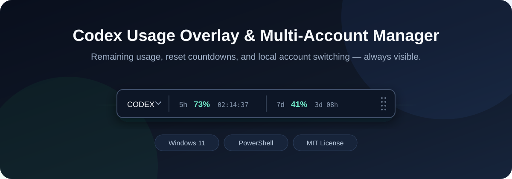
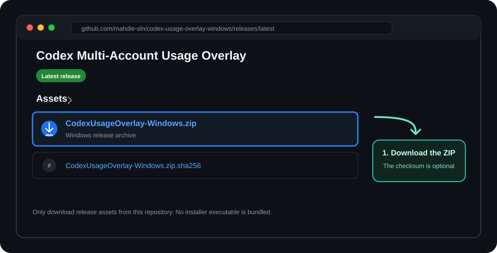
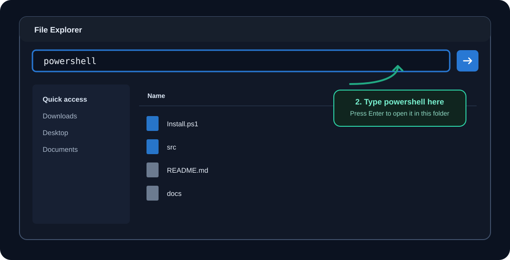
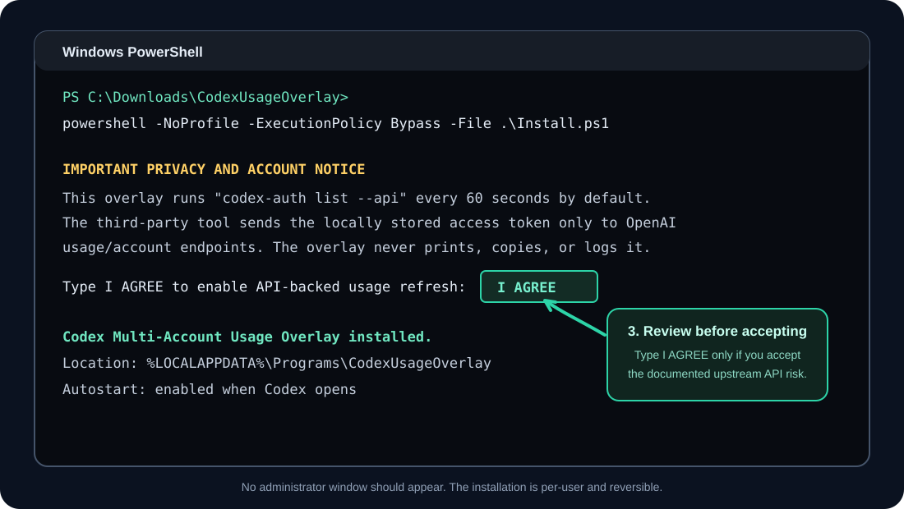
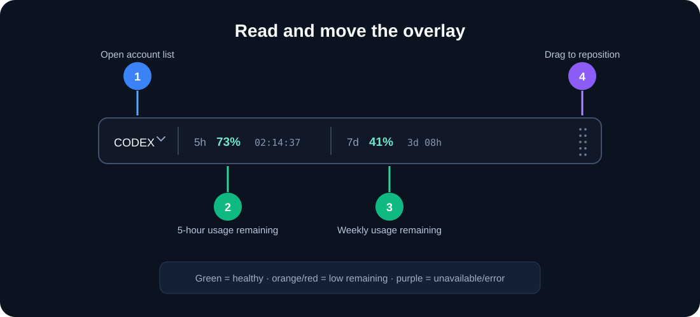
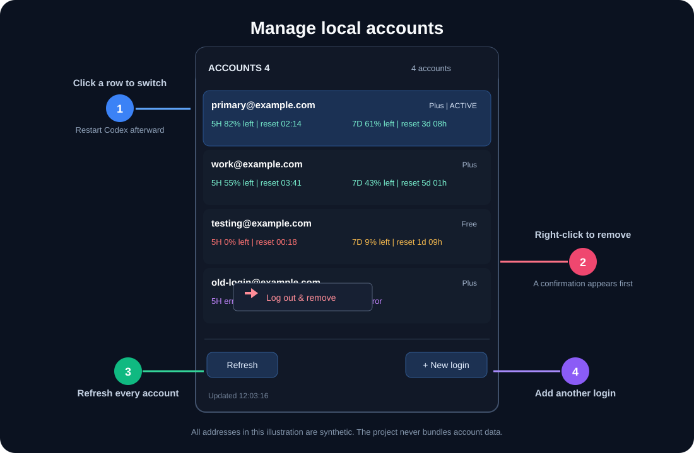

# Codex Usage Overlay & Multi-Account Manager for Windows

[](https://github.com/mahdie-sln/codex-usage-overlay-windows/actions/workflows/test.yml)



A compact, draggable, always-on-top Windows overlay and multi-account manager
for monitoring Codex usage without repeatedly opening the Usage panel. It shows
the remaining 5-hour and weekly allowances, live reset countdowns, warnings,
and every account already managed by `codex-auth`.

> This is an independent community project. It is not affiliated with,
> endorsed by, or supported by OpenAI.

## What it does

- Shows **5-hour** and **weekly** remaining percentages and reset countdowns.
- Warns at **20%**, **10%**, and **5%** remaining.
- Stays above other windows without taking keyboard focus from Codex.
- Opens a compact account panel when you click **CODEX**.
- Shows usage and reset information for every locally signed-in account.
- Sorts refreshed accounts by usable capacity, followed by 0% accounts, then
  unavailable/error rows.
- Switches accounts only after an explicit click, using
  `codex-auth switch --skip-api`.
- Adds accounts with `codex-auth login --device-auth`.
- Removes a selected local login only after a right-click and confirmation,
  using the exact `codex-auth remove <email>` command.
- Starts automatically when the Codex desktop app opens.
- Provides Refresh, Restart, Show/Hide, Autostart, and Exit controls in the
  Windows system tray.

## Before you install

### Requirements

- Windows 11
- OpenAI Codex desktop app for Windows
- Windows PowerShell 5.1 or PowerShell 7
- Node.js/npm
- [`@loongphy/codex-auth`](https://github.com/Loongphy/codex-auth) `0.2.10`
  (tested version)

Install and configure the external dependency first:

```powershell
npm install -g @loongphy/codex-auth
codex-auth --version
codex-auth login --device-auth
codex-auth list --api
```

If `codex-auth list --api` already displays your accounts, you can continue.
The dependency is not bundled in this repository or in the release ZIP.

### Important API and account notice

The overlay refreshes by running:

```text
codex-auth list --api
```

The upstream `codex-auth` project states that API mode sends the locally stored
ChatGPT access token to OpenAI usage/account endpoints and warns that this mode
may carry account or terms-of-service risk. Read the upstream project and this
repository's [privacy statement](docs/PRIVACY.md) before installing.

The overlay itself has no analytics, telemetry, update server, or project-owned
backend. It does not display, copy, bundle, upload, or log authentication
tokens. Raw command output is parsed in memory and discarded.

## Install — step by step

### 1. Download the release ZIP

Open [Releases](https://github.com/mahdie-sln/codex-usage-overlay-windows/releases/latest),
expand **Assets**, and download the file ending in `-windows.zip`. Download the
matching `.sha256` file if you want to verify the archive.



### 2. Extract the ZIP and open PowerShell

Right-click the ZIP, choose **Extract All**, open the extracted folder, click
the File Explorer address bar, type `powershell`, and press Enter.



### 3. Run the installer

In that PowerShell window, run:

```powershell
powershell -NoProfile -ExecutionPolicy Bypass -File .\Install.ps1
```

Read the API notice. If you accept it, type `I AGREE` exactly and press Enter.
Administrator rights are not required.



The default installation directory is:

```text
%LOCALAPPDATA%\Programs\CodexUsageOverlay
```

The installer creates Desktop and Start Menu shortcuts and a reversible
current-user Scheduled Task named **Codex Usage Overlay**. The task runs a
lightweight local watcher and opens the overlay whenever Codex opens.

## Use — step by step

### Read and move the bar



1. Click **CODEX** to open or close the account list.
2. Read the green percentage after **5h** and **7d** as the amount remaining.
3. Read the muted text beside each percentage as the reset countdown.
4. Drag the dotted handle at the right edge to move the overlay.

The overlay is always on top by default, does not request keyboard focus, and
remembers its last position.

### Manage local accounts



- **Switch:** click an inactive account row. The row is revalidated before the
  switch runs. Fully quit and reopen Codex afterward so the desktop app uses the
  new account.
- **Add:** click **+ New login** and finish device authorization in the opened
  terminal/browser flow.
- **Remove local login:** right-click an account, choose **Log out & remove**,
  review the selected email, and confirm. This removes only that local
  `codex-auth` login; it does not delete the online OpenAI account.
- **Refresh:** click **Refresh** in the lower-left corner.
- **Close the panel:** click **CODEX** again or click anywhere outside it.

After a switch or local removal, the panel stays open and refreshes in place.

### System-tray controls

Right-click the overlay icon in the Windows system tray for:

- Show/Hide overlay
- Show/Hide accounts
- Refresh now
- Move to top-right
- Enable or disable automatic startup with Codex
- Restart
- Exit

If you exit the overlay, open it again from the Desktop or Start Menu shortcut.

## Configuration

The installed configuration file is:

```text
%LOCALAPPDATA%\Programs\CodexUsageOverlay\config.json
```

Restart the overlay after editing it. Available settings are documented in
[`config.example.json`](src/config.example.json).

`codex-auth list --api` does not return subscription-expiry dates. The overlay
therefore never guesses them. If you know an expiry date, add it manually under
`accountExpiryDates` in `config.json`.

## Update

1. Download and extract the newer release ZIP.
2. Run the new `Install.ps1` using the installation command above.

The installer stops an existing overlay and watcher before updating, preserves
the local configuration, and safely migrates the earlier
`C:\Tools\CodexUsageOverlay` installation if it is present.

## Uninstall completely

Exit the overlay from its tray menu, then run:

```powershell
powershell -NoProfile -ExecutionPolicy Bypass -File "$env:LOCALAPPDATA\Programs\CodexUsageOverlay\Uninstall.ps1"
```

The uninstaller removes the overlay's task, shortcuts, logs, settings, and
known installed files. It does not uninstall `codex-auth`, modify Codex, or
remove any Codex/OpenAI account data. Add `-KeepConfig` if you want to retain
`config.json`.

If the installed uninstaller is missing, open PowerShell in a freshly extracted
release ZIP and run `Uninstall.ps1` from there. It also detects and removes the
earlier `C:\Tools\CodexUsageOverlay` installation.

## Troubleshooting

### The overlay says usage is unavailable

Run this in a normal terminal:

```powershell
codex-auth list --api
```

If that command fails, fix or refresh the affected `codex-auth` login first.
The overlay deliberately shows only `error` and never logs raw credentials or
authorization details.

### The overlay does not open

- Open **Codex Usage Overlay** from the Start Menu.
- Check the tray's hidden-icons area.
- Right-click the tray icon and choose **Restart**.
- Confirm that `codex-auth --version` works in a new terminal.

### The old interface still appears after an update

Run the current release's `Install.ps1` again. The installer disables the old
watcher first, stops stale overlay processes, replaces the scheduled task, and
then starts the current interface. A Windows restart should not be necessary.

### Codex still shows the previous account

Account switching changes the local `codex-auth` selection. Fully quit Codex,
including its background process, and open it again.

## Development and verification

Run the repository tests on Windows:

```powershell
powershell -NoProfile -ExecutionPolicy Bypass -File .\tests\Test-Package.ps1
powershell -NoProfile -ExecutionPolicy Bypass -File .\tests\Test-UsageParser.ps1
powershell -NoProfile -ExecutionPolicy Bypass -File .\tests\Test-InstallCycle.ps1
powershell -NoProfile -ExecutionPolicy Bypass -File .\tools\Build-Release.ps1
```

The package test parses every PowerShell file, verifies required files and safe
configuration defaults, searches for credential-like data, and rejects direct
network code in the overlay. The parser test uses a local fixture executable;
the install-cycle test uses isolated temporary directories. Neither test starts
the real `codex-auth` executable or touches account data.

The build command creates `dist\CodexUsageOverlay-Windows.zip` and a matching
SHA-256 file from an explicit allowlist of user-facing files.

### Repository layout

| Path | Purpose |
| --- | --- |
| `src/` | Overlay runtime, account helpers, launchers, and example configuration |
| `docs/` | Architecture, privacy, testing, notices, changelog, and documentation images |
| `tests/` | Static validation and isolated install/uninstall tests |
| `tools/` | Reproducible release packaging |
| `.github/` | CI workflow, contribution guide, security policy, and issue templates |
| `Install.ps1` / `Uninstall.ps1` | Simple user-facing entry points kept at the repository root |

See [ARCHITECTURE.md](docs/ARCHITECTURE.md), [TESTING.md](docs/TESTING.md),
[SECURITY.md](.github/SECURITY.md), and
[CONTRIBUTING.md](.github/CONTRIBUTING.md) before reporting issues or sharing
logs.

## License

MIT. See [LICENSE](LICENSE) and
[THIRD_PARTY_NOTICES.md](docs/THIRD_PARTY_NOTICES.md).
